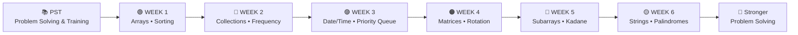
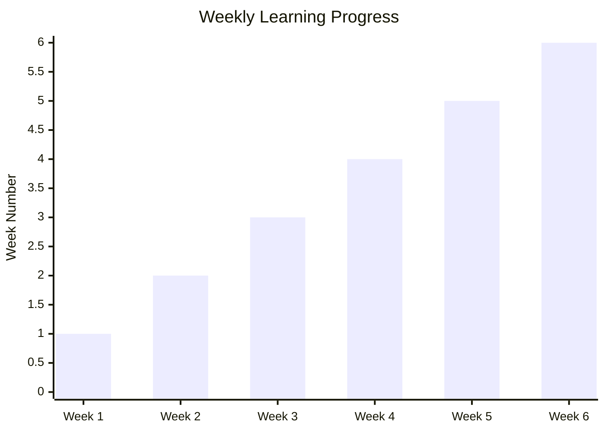
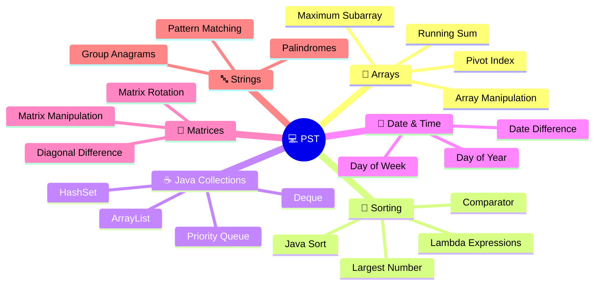
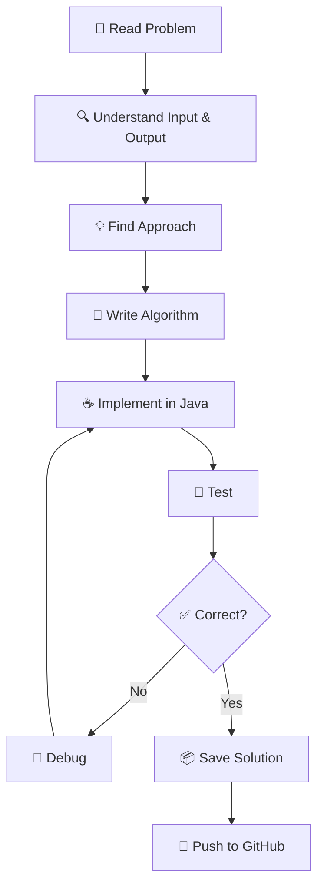
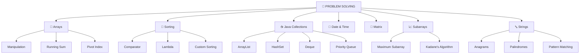
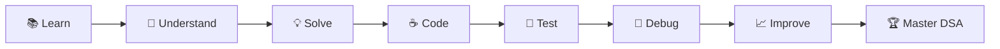

# 🚀 Problem Solving & Testing — VTU27586

<div align="center">

## 💻 Problem Solving and Training (PST)

**A visual weekly journey through Java, DSA, algorithms, collections, and coding practice.**

</div>

---

## 📊 Repository at a Glance

| 📚 Category | 📌 Details |
|---|---|
| 🗂️ Weekly Modules | **6 Weeks** |
| 💻 Main Language | **Java** |
| 🧠 Focus | **Problem Solving + DSA + Testing** |
| 🧩 Format | **Weekly Problem Sets** |
| 📝 Repository Commits | **34** |
| 🌐 Repository | **VTU27586** |

---

## 🗺️ Visual Learning Roadmap



---

## 📈 Weekly Progress



> The chart represents the progression through the six repository modules.

---

## 🧩 Topics Covered



---

## 📚 Week-by-Week Visual Map

### 🟢 WEEK 1 — Arrays & Sorting

```text
┌─────────────────────────────────────┐
│            🟢 WEEK 1                │
├─────────────────────────────────────┤
│ 🔢 Running Sum                      │
│ 🔎 Find Pivot Index                 │
│ 💰 Richest Customer Wealth          │
│ 🔀 Sort Array By Parity             │
│ 📐 Squares of a Sorted Array        │
│ 🏆 Java Sort                        │
│ ⚖️ Comparator                       │
│ λ Lambda Expressions                │
└─────────────────────────────────────┘
```

**Main skills:** Arrays • Sorting • Comparator • Lambda Expressions

---

### 🔵 WEEK 2 — Collections & Frequency

```text
┌─────────────────────────────────────┐
│            🔵 WEEK 2                │
├─────────────────────────────────────┤
│ 🔢 Build Array from Permutation     │
│ ⛰️ Find the Highest Altitude        │
│ 🔤 Group Anagrams                   │
│ 📦 Java Deque                       │
│ 🧩 Java HashSet                     │
│ 📈 Maximum Subarray                 │
│ 🗑️ Remove Duplicates                │
│ ✂️ Remove Element                   │
│ 🔀 Shuffle the Array                │
│ 🔝 Top K Frequent Elements          │
└─────────────────────────────────────┘
```

**Main skills:** Collections • Hashing • Frequency Analysis • Arrays

---

### 🟣 WEEK 3 — Date/Time & Priority Queue

```text
┌─────────────────────────────────────┐
│            🟣 WEEK 3                │
├─────────────────────────────────────┤
│ 📅 Day of the Week                  │
│ 📆 Day of the Year                  │
│ 📋 Java ArrayList                   │
│ ⏰ Java Date and Time               │
│ 🏃 Java Priority Queue              │
│ 🔢 Largest Number                   │
│ 📅 Days Between Two Dates           │
│ 👥 Sort the People                  │
└─────────────────────────────────────┘
```

**Main skills:** Java Collections • Date/Time • Priority Queue • Sorting

---

### 🟠 WEEK 4 — Matrix Algorithms

```text
┌─────────────────────────────────────┐
│            🟠 WEEK 4                │
├─────────────────────────────────────┤
│                                     │
│          🔲 MATRIX                  │
│             │                       │
│      ┌──────┼──────┐                │
│      ▼      ▼      ▼                │
│   🔢 2D    ↔️     🔄               │
│  Arrays  Diagonal Rotation          │
│                                     │
└─────────────────────────────────────┘
```

**Main skills:** 2D Arrays • Matrix Manipulation • Diagonal Operations • Rotation

---

### 🔴 WEEK 5 — Subarrays & Strings

```text
┌─────────────────────────────────────┐
│            🔴 WEEK 5                │
├─────────────────────────────────────┤
│                                     │
│       📈 SUBARRAYS                  │
│            │                        │
│      ┌─────┴─────┐                  │
│      ▼           ▼                  │
│  Maximum      Kadane's               │
│  Subarray    Algorithm              │
│                                     │
│             +                       │
│                                     │
│        🔤 STRINGS                   │
│                                     │
└─────────────────────────────────────┘
```

**Main skills:** Subarrays • Kadane's Algorithm • String Manipulation

---

### 🟡 WEEK 6 — Advanced Strings

```text
┌─────────────────────────────────────┐
│            🟡 WEEK 6                │
├─────────────────────────────────────┤
│                                     │
│          🔤 STRINGS                 │
│             │                       │
│     ┌───────┼────────┐              │
│     ▼       ▼        ▼              │
│   🔁       🪞       🧩             │
│ Pattern  Palindrome  Matching       │
│                                     │
│          🚀 ADVANCED                │
│          PROBLEMS                   │
└─────────────────────────────────────┘
```

**Main skills:** Advanced Strings • Palindromes • Pattern Matching

---

## 🔄 Problem-Solving Workflow



---

## 🏗️ Repository Architecture

```text
📦 Problem-solving-and-testing-VTU27586
│
├── 🟢 WEEK 1
│   ├── Arrays
│   ├── Sorting
│   ├── Comparator
│   └── Lambda
│
├── 🔵 WEEK 2
│   ├── Arrays
│   ├── HashSet
│   ├── Deque
│   └── Frequency
│
├── 🟣 WEEK 3
│   ├── Date & Time
│   ├── ArrayList
│   ├── Priority Queue
│   └── Sorting
│
├── 🟠 WEEK 4
│   └── Matrix Algorithms
│
├── 🔴 WEEK 5
│   ├── Subarrays
│   ├── Kadane's Algorithm
│   └── Strings
│
├── 🟡 WEEK 6
│   ├── Advanced Strings
│   ├── Palindromes
│   └── Pattern Matching
│
├── 📄 README.md
└── 📄 .gitignore
```

---

## 🧠 Skills Map



---

## 🛠️ Technology Stack

```text
             💻 TECHNOLOGY STACK

                 ☕ JAVA
                   │
        ┌──────────┼──────────┐
        ▼          ▼          ▼
      🧠 DSA     🧪 TEST     🔧 GIT
        │          │          │
        └──────────┼──────────┘
                   ▼
             🐙 GITHUB
                   │
                   ▼
            🚀 PROJECT WORK
```

| Technology | Purpose |
|---|---|
| ☕ Java | Main programming language |
| 🧠 DSA | Algorithmic problem solving |
| 🧪 Testing | Validate solutions |
| 🔧 Git | Version control |
| 🐙 GitHub | Code hosting and progress tracking |

---

## 📊 Repository Statistics

```text
┌──────────────────────────────────────────────┐
│              📊 PROJECT STATS                │
├──────────────────────────────────────────────┤
│                                              │
│   📚 Weekly Modules       ██████  6          │
│   💻 Main Language        ██████  Java       │
│   📦 Repository Commits   █████████████ 34   │
│   🧠 Core Focus           DSA + Problem Solving│
│                                              │
└──────────────────────────────────────────────┘
```

---

## 🎯 Learning Goals



### ✅ Goals

- [x] Practice array problems
- [x] Practice sorting
- [x] Learn Java Collections
- [x] Practice Date & Time
- [x] Practice matrix algorithms
- [x] Practice subarray problems
- [x] Practice string problems
- [ ] Improve time and space complexity
- [ ] Solve more advanced DSA problems
- [ ] Improve competitive programming skills

---

## 📌 Quick Navigation

| Week | Focus |
|---|---|
| 🟢 [WEEK 1](./WEEK%201) | Arrays • Sorting • Comparator • Lambda |
| 🔵 [WEEK 2](./WEEK%202) | Collections • HashSet • Deque • Frequency |
| 🟣 [WEEK 3](./WEEK%203) | Date/Time • ArrayList • Priority Queue |
| 🟠 [WEEK 4](./WEEK%204) | Matrix • Diagonal • Rotation |
| 🔴 [WEEK 5](./WEEK%205) | Subarrays • Kadane • Strings |
| 🟡 [WEEK 6](./WEEK%206) | Strings • Palindromes • Pattern Matching |

---

## 🚀 How to Run

```bash
# Clone repository
git clone https://github.com/Balabaypureddy/Problem-solving-and-testing-VTU27586.git

# Enter repository
cd Problem-solving-and-testing-VTU27586

# Open any WEEK folder
cd "WEEK 1"
```

Then open the required Java/problem file and run it using your preferred Java environment.

---

## 🌟 Repository Journey

```text
          📚 LEARN
             │
             ▼
        🧩 PRACTICE
             │
             ▼
         💻 CODE
             │
             ▼
         🧪 TEST
             │
             ▼
        🐛 DEBUG
             │
             ▼
        📈 IMPROVE
             │
             ▼
        🚀 ADVANCE
```

---

<div align="center">

## 💻 Keep Coding • Keep Learning • Keep Improving 🚀

### Problem Solving & Testing — VTU27586

**6 Weeks • Java • DSA • Algorithms • Testing**

</div>
